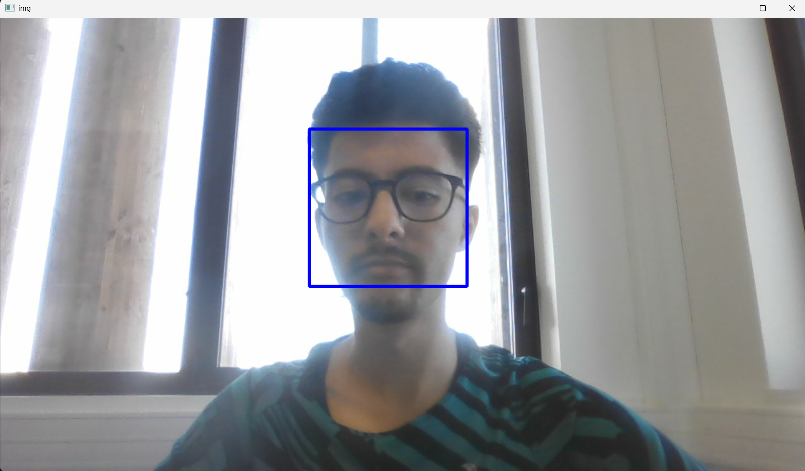

# ProjetReconnaissanceVisage : Détection des visages avec OpenCV et HaarCascade
L'objectif de ce projet est d'utiliser la cascade de Haar pour faire de la détéction de visages, pour cela on aura besoin de télécharger le fichier : haarcascade_frontalface_default.xml ; Celui ci est un modèle déjà entrainé à détecter des motifs en noir et blanc qui définissent le contraste d'un visage. C'est aussi pourquoi la détéction fonctionnera moins bien sur des visages plus foncées ou avec moins de contraste entre les différentes parties du visage.

Je commence par tester ce modèle sur une photo : 

```
import cv2
face_cascade = cv2.CascadeClassifier(r"C:\Users\Abdessamad\Downloads\haarcascade_frontalface_default.xml")
img = cv2.imread(r"C:\Users\Abdessamad\Downloads\test.png") #lecture de l'image en entrée
gray = cv2.cvtColor(img, cv2.COLOR_BGR2GRAY)  #Changement de l'image en niveaux de gris
faces = face_cascade.detectMultiScale(gray, 1.1 , 4) #Détection du visage
for (x, y, w , h) in faces:
    cv2.rectangle(img, (x,y),(x+w, y+h), (255, 0, 0) ,3)  #Dessin du réctangle
cv2.imshow('img', img) #Affichage de l'image
cv2.waitKey()

```
Et ça donne ça : 


Comme on peut le voir, la cascade de Haar a bien reconnu mon visage même si la qualité de l'image laisse a désirer...

On refait la même chose sur une vidéo pour voir le résultat : 

```
import cv2
face_cascade = cv2.CascadeClassifier(r"C:\Users\Abdessamad\Downloads\haarcascade_frontalface_default.xml")
cap = cv2.VideoCapture(r"C:\Users\Abdessamad\Downloads\testvid.mp4")#Lecture de la vidéo en entrée
while cap.isOpened(): 
    _, img = cap.read() #Boucle sur chaque frame de la vidéo
    gray = cv2.cvtColor(img, cv2.COLOR_BGR2GRAY) #Changement de la frame en niveaux de gris
    faces = face_cascade.detectMultiScale(gray, 1.1 , 4) #Détéction du visage
    for (x, y, w , h) in faces:
        cv2.rectangle(img, (x,y),(x+w, y+h), (255, 0, 0) ,3) #Dessin du réctangle sur chaque frame
        cv2.imshow('img', img) #affichage de la frame
        if cv2.waitKey(1) & 0xFF == ord('q'): #Si appui sur q, la rediffusion s'arrête 
            break
cap.release()
```

Et voici ce que ça donne en vidéo : 


